# WSE 系统架构设计白皮书

*软硬件一体系统设计文档 · 版本 v0.1（草案）*

2026-09-17

## 摘要

WSE 是一款**用带宽换时延**的加速器：单核算力低于 Davinci，但每核独享 1 TB/s 的 local DRAM，把大模型解码阶段的搬运-bound 算子从「等权重」变成「算权重」。它以 WSE-Lite 形态作为 Davinci 的协处理器，承接 MoE FFN 与 Attention 权重投影两类算子。

单核的平衡点可以从规格直接算出，这是整个方案的出发点：

| 量 | 取值 | 由什么推出 |
|---|---|---|
| Cube FP16 算力 | 11.5 TFLOPS/核 | 16×16×16 MAC/cycle × 2 FLOP × 1.4 GHz |
| Cube FP8 / FP4 | 45.9 / 91.8 TFLOPS/核 | 16×32×32、16×64×32，比例 1:4:8 |
| local DRAM 带宽 | 1 TB/s/核 | 规格给定 |
| **计算强度平衡点** | **11.5 FLOP/Byte（FP16）**、45.9（FP8） | 算力 ÷ 带宽 |
| 解码 GEMV 的实际强度 | ≈ 2×batch FLOP/Byte | 每个权重字节被用一次 |

平衡点除以 2 就是**不再搬运-bound 所需的最小 batch**：FP16 下约 6，FP8 下约 23。Davinci 的同一比值要大一个量级，这正是它在解码阶段跑不满的原因。

**本文的边界。** 结构上先立系统（第一、二、三部分：定位、硬件、软件栈），再串流程（第四部分：编译期 → 加载期 → 运行期，从用户写的 Python 算子一路到 NoC 上的 flit），最后落到业务算子（第五部分）。

**信息来源。** 硬件规格、部署形态、业务场景来自需求方给定；Calendar 通信方案、`.rodata`/D-Cache 下发链路、PTO/CCE 接口面来自本仓库既有设计文档；PyPTO 与 PTO-ISA 的公开部分来自开源仓库。三者之外的内容一律记入附录的待确认清单，**不做补写**。

---

## 第一部分 · 系统定位

## 1. 设计动机与系统定位

WSE 不是一个更快的 Davinci，而是把 Davinci 跑不满的那一半工作拿走的专用件。

### 1.1 解码阶段为什么是搬运-bound

预填阶段的 GEMM 每个权重字节被复用 seqLen 次，计算强度轻松过百；解码阶段退化成 GEMV，每个权重字节只被乘一次，计算强度 ≈ 2×batch FLOP/Byte。当 batch 远小于硬件平衡点时，Cube 绝大部分时间在等权重到达。

两类算子受影响最重，它们就是 WSE 的目标：

| 算子 | 为什么搬运-bound | 交给 WSE 的部分 |
|---|---|---|
| **MoE FFN** | 每 token 只激活少数专家，但整个专家的权重矩阵都要读进来；有效 batch 被路由打散到接近 1 | 整个 FFN（up / gate / down 投影） |
| **Attention 权重投影** | Q/K/V 前投影与 O 后投影是纯权重 GEMV，与 KV 长度无关 | **仅前后投影**；Score·Softmax·AV 主体留在 Davinci |

Attention 主体（QKᵀ / Softmax / AV）的瓶颈是 KV Cache 而不是权重，行为与权重投影完全不同，因此不在 WSE 上。这条分界是三分离部署的全部依据。

### 1.2 用带宽换时延的取舍

WSE 在四个维度上做了与通用架构相反的选择：

1. **每核独享 local DRAM，不再有 GM。** 1 TB/s × 384 MB 直接挂在核上，取消了全局显存这一级共享瓶颈，代价是核间再也不能靠共享内存交换数据。
2. **算力降级。** 单核 Cube 保持 16³ 形状，不加宽；省下的面积和功耗给了存储与互连。
3. **低精度优先。** FP8 与 FP4 不仅把算力提到 4× / 8×，更关键的是把权重字节数降到 1/2 与 1/4——对搬运-bound 算子，后者才是真正的加速来源。
4. **确定性优于峰值。** NoC 上的集合通信走编译期规划好的 Calendar 时隙（第 11 节），用"不拥塞"换"尾时延可预测"。

### 1.3 三分离部署

一个解码 step 被拆到三类器件上，按算子的 roofline 属性划分，而不是按层划分：

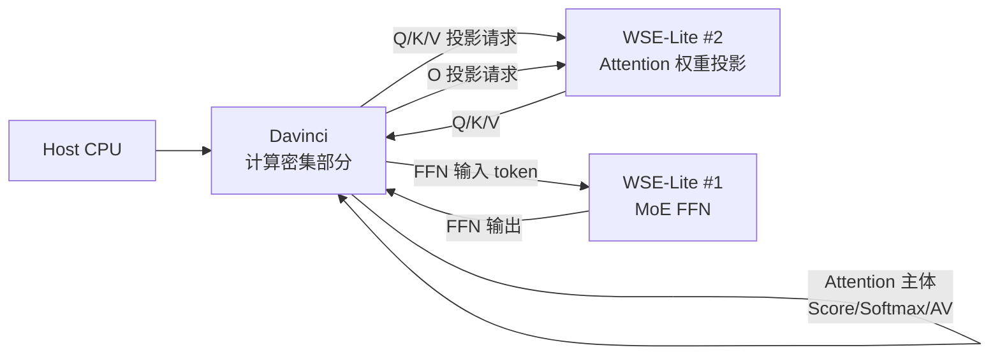

| 器件 | 承担 | 主要驻留数据 |
|---|---|---|
| Davinci | Attention 主体、Norm、采样、调度与控制流 | KV Cache |
| WSE-Lite #1 | MoE FFN（含专家选择后的三个投影） | 专家权重 |
| WSE-Lite #2 | Attention 的 Q/K/V/O 投影 | 投影权重 |

两台 WSE-Lite 都是**协处理器**：不持有模型控制流，不决定执行顺序，只对 Davinci 下发的请求做固定形状的响应。权重在模型加载时就已驻留在各核 local DRAM，稳态下不再重新下发。

### 1.4 这个划分带来的两个新问题

三分离把内存墙换成了另外两堵墙，它们决定了后文大部分设计：

- **器件间往返时延。** 每层至少两次 Davinci ↔ WSE 往返，这部分开销全落在 UB 组网与 Batcher 上（第 6 节）。
- **核间通信取代共享内存。** 没有 GM，切分后的 tensor 只能靠 NoC 上的显式集合通信拼回来（第 16 节）。

---

## 第二部分 · 硬件架构

## 2. 硬件架构总览

WSE 硬件是四层：对外靠 UB 总线组网，对内靠 Batcher 分发，核间靠 NoC，核内靠每核自己的 local DRAM。没有任何一级是全局共享的读写内存。

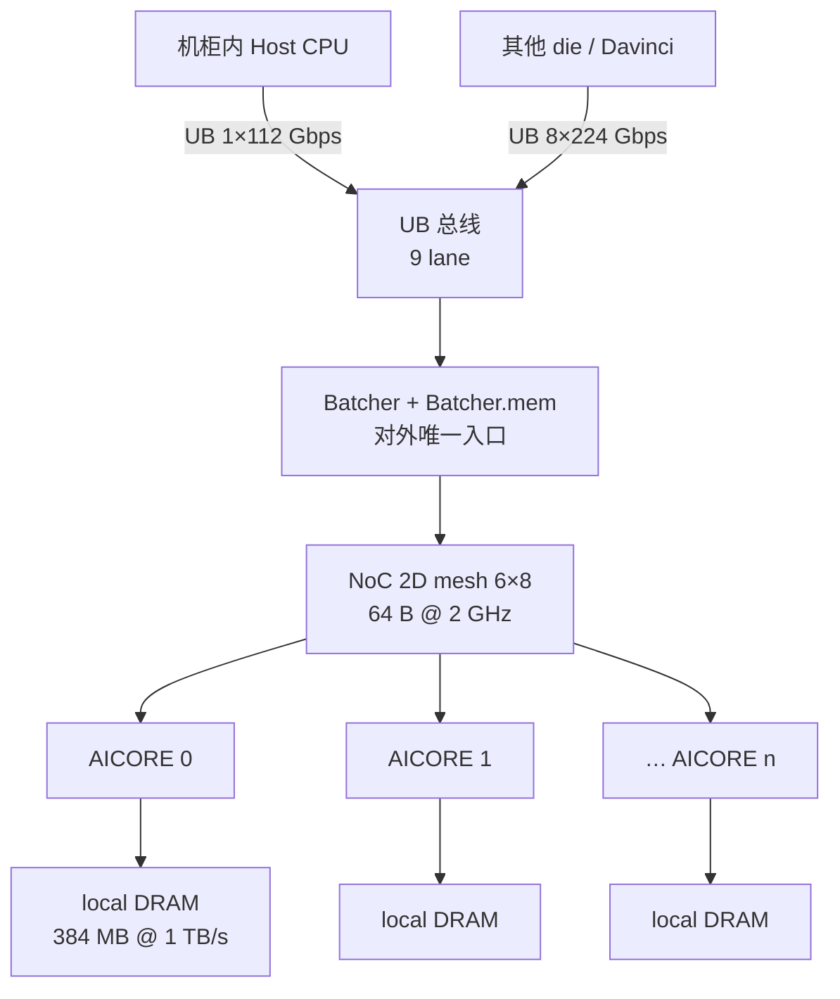

### 2.1 四个部件的职责边界

| 部件 | 职责 | 不承担什么 |
|---|---|---|
| **UB 总线** | 机柜内与 die 间互连；接 Host CPU 与 Davinci | 不直接触及 AICORE |
| **Batcher** | 外部 ↔ AICORE 的唯一桥梁；输入数据、kernel 二进制下发；结果回写落点 | 不参与核间数据交换 |
| **NoC** | 核间 payload 搬运与集合通信 | 不承担对外 I/O；不存储路由表 |
| **AICORE + local DRAM** | 计算与权重驻留 | local DRAM 不对其他核可见 |

两条结构性约束贯穿全文：

- **对外只有一个口。** 任何从片外进入 AICORE 的字节必经 Batcher，AICORE 的输出也必须回写 Batcher。指令与常量的 cache miss 回填也走这条路（第 4 节）。
- **对内没有共享内存。** 核 A 要拿到核 B 的数据，只能由核 B 主动从 NoC 发出去。

### 2.2 三个时钟域

| 边界 | 关系 | 后果 |
|---|---|---|
| Reticle 内 NoC | 同步，2 GHz | Calendar 时隙可以按 cycle 编排 |
| AICORE ↔ NoC | **异步**（1.4 GHz ↔ 2 GHz） | 跨界需握手；核程序不感知 NoC cycle |
| Batcher ↔ AICORE | **异步** | Batcher 下发与核执行不共享时间基准 |

这三道边界解释了 Calendar 方案为什么把对齐做成硬件内部的事：核程序只能表达"我到了"，无法表达"第几拍发"，发包时机必须由 NoC 侧的 `CalReg` 决定。

> **命名冲突提醒。** 本文里"UB"有两个含义：核内的 **Unified Buffer（384 KB 片上缓冲）**，和对外的 **UB 总线（组网互连）**。下文凡指缓冲处写作"UB（Unified Buffer）"，指互连处写作"UB 总线"。

## 3. AICORE 微架构与规格

一个 AICORE = 1 个 Cube + 1 个 Vector，主频 1.4 GHz。计算部分沿用 Davinci 的流水组织（Scalar 发射，MTE 搞搬运，Cube/Vector 算，FixPipe 写回），改动全部集中在存储侧。

### 3.1 计算规格

| 精度 | Cube 形状（M×K×N per cycle） | MAC/cycle | 单核算力 @1.4 GHz | 比例 |
|---|---|---|---|---|
| FP16 | 16×16×16 | 4 096 | 11.5 TFLOPS | 1 |
| FP8 | 16×32×32 | 16 384 | 45.9 TFLOPS | 4 |
| FP4 | 16×64×32 | 32 768 | 91.8 TFLOPS | 8 |

Vector 并行度 256 B/cycle，即 FP16 下 128 elem/cycle、179 G elem/s。FixPipe 带宽 256 B/cycle，与 Vector 齐平。

**一个值得注意的比例。** FP16 下 Cube 每 cycle 消费 16×16 = 256 个权重元素 = 512 B，而 local DRAM 每 cycle 只能供 1 TB/s ÷ 1.4 GHz ≈ 714 B。两者同量级——这正是 WSE 的设计点：**在权重只用一次的场景下，Cube 与内存带宽大致匹配**。

### 3.2 片上存储层次

| 层级 | 容量 | 用途 |
|---|---|---|
| L0A | 128 KB | Cube 左矩阵（激活） |
| L0B | **512 KB** | Cube 右矩阵（权重） |
| L0C | 256 KB | Cube 累加输出 |
| L1 | 1 MB | 片上大缓冲 |
| UB（Unified Buffer） | 384 KB | Vector 工作区；核间通信竞技场候选位置 |
| local DRAM | 384 MB @ 1 TB/s，2 KB page | 本核权重与大张量驻留 |

### 3.3 与 Davinci 基线的差异

| 项 | Davinci 基线 | WSE | 为什么改 |
|---|---|---|---|
| 全局内存 | GM（HBM，全片共享） | **取消**，换成每核 local DRAM | 去掉共享带宽瓶颈 |
| L0B | 较小 | **512 KB**，是 L0A 的 4 倍 | 权重驻留面更大，减少重复加载 |
| 低精度 | 以 FP16/INT8 为主 | 增 FP8 / FP4，算力 4× / 8× | 权重字节数减半 / 减四分之三 |
| 核间通信 | 经 GM 或 HCCS | **NoC + Calendar** 显式集合通信 | 没有 GM 可经 |
| 对外通道 | PCIe / 设备直通 | **必经 Batcher** | 单入口，便于集中调度 |

### 3.4 对算子开发的直接影响

- **2 KB page 是实际读写粒度。** 比这小的随机访存浪费带宽；权重布局应按 2 KB 对齐切块。
- **容量决定切分下界。** 单核 384 MB 是权重驻留的硬上限，直接决定一个专家能否整体放下、要切几份（第 17 节）。
- **L1 不再是路由表的家。** Calendar 方案把路由信息放进 `.rodata`，经 D-Cache 取用，**不占 L1**，因此不与 GEMM 的 L1 分配器互斗（第 4 节）。

## 4. 存储层次与数据通路

去掉 GM 后，数据在 WSE 上走**两条完全不同且互不相交**的路。把它们分开是读懂本系统的关键。

### 4.1 两条路

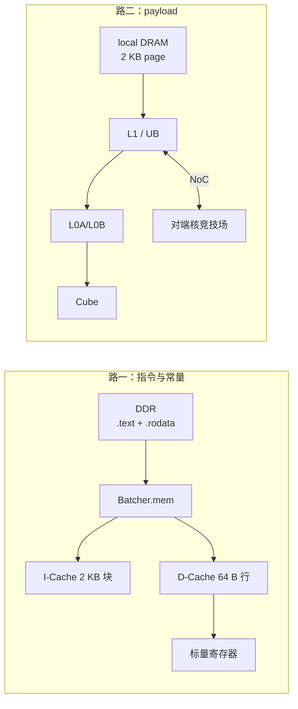

| | 路一：指令与常量 | 路二：payload |
|---|---|---|
| 走什么 | kernel 代码、立即数、`.rodata` 静态表、kernel 入参 | 权重、激活、中间结果 |
| 链路 | **DDR → Batcher.mem → I$ / D$** | local DRAM ↔ L1/UB ↔ L0 ↔ Cube；跨核走 NoC |
| 粒度 | I$ 2 KB 块，D$ 64 B 行 | local DRAM 2 KB page；NoC 64 B flit |
| 频度 | 模型加载一次 + 冷 miss | 每轮推理 |
| **不经过** | ★ **不经 local DRAM、不经 L1** | 不经 I$/D$ |

这条★常被误读。指令和常量的 cache 回填 **不走 local DRAM**——local DRAM 是算子数据面的存储，不是核的主存；也 **不走 L1**，L1 完全留给 GEMM。

### 4.2 一条 LD 背后的三条链

任何一条标量 load 的值，按**户籍**分三类，三类的时间尺度差一个数量级：

| 类 | 来源 | 时间尺度 | 例子 |
|---|---|---|---|
| **A 类** | 编译期确定，随二进制一起下发 | **模型加载一次** | 立即数（→ `.text`）、静态表（→ `.rodata`） |
| **B 类** | 运行期由 Host/Runtime 下发 | **每次 launch** | kernel 入参、tiling、`blockId` |
| **C 类** | 核自己产生，没有上游 | 运行期 | 栈、中间变量 |

把一个值从 B 类推到 A 类，等于把它的下发频度从"每次 launch"降到"模型加载一次"。Calendar 方案对路由表做的就是这件事（第 11 节）。

### 4.3 静态表为什么不撞爆 D-Cache

直觉上，把全片所有节点的路由位图都发射成一张表（die 级一份拷贝）会把 D-Cache 撑爆。实际不会，原因只有两条：

1. D-Cache **只在被某条 LD 实际命名过的地址上分配行**；没被访问的字节永远躺在 DDR。
2. 索引用的 `blockId` 在整个 kernel 内是常量。

两条合起来，本核触碰的地址集合可以在编译期完整枚举：每个 key 恰好 2 条 LD、落在同一条 64 B 行上。于是每核占用 = `keyCount` 条 cache 行，**与全片节点数无关**。

这与"随机索引大 LUT"的区别不在表大，而在**下标的时间性质**：后者的下标每次迭代都在变，工作集 = 整张表；前者的下标每核一次确定，访问模式退化成"每 key 一个固定地址"，首次 miss 后 100% 命中。

### 4.4 带宽汇总

| 链路 | 带宽 | 算法 |
|---|---|---|
| local DRAM（每核） | 1 TB/s | 规格 |
| NoC 单链路单向 | **128 GB/s** | 64 B × 2 GHz |
| UB 总线对外（组网） | **224 GB/s** | 8 × 224 Gbps |
| UB 总线对 Host CPU | **14 GB/s** | 1 × 112 Gbps |

**这张表里藏着系统的真正约束：每核 local DRAM 带宽是单条 NoC 链路的约 8 倍。** 核内读权重很快，核间搬运很慢。任何切分方案若需要把与权重同量级的数据过 NoC，都会把 WSE 的带宽优势抵消掉——这是第 17 节选择切 N 轴而不是切 K 轴的根本原因。

## 5. NoC 架构

### 5.1 拓扑与带宽

| 项 | 取值 |
|---|---|
| 拓扑 | 2D mesh 6×8（1 Reticle） |
| 总线位宽 | 64 B |
| 时钟 | 2 GHz，Reticle 内同步 |
| 单链路单向带宽 | 128 GB/s |
| 对角跳数 | 5 + 7 = 12 跳（维序路由下的最坏情况） |

2D mesh 的代价在于**中心链路是天然热点**：多对多集合通信下，中间行列的链路要承载远多于边缘的流量。对带宽型负载，这意味着尾时延不可控。

### 5.2 为什么需要 Calendar

传统动态仲裁（虚通道 + 背压）在此不适用，因为本系统的核心诉求是**极低时延**而不是峰值吞吐：

| 动态仲裁 | Calendar |
|---|---|
| 拥塞时背压，尾时延长尾 | 编译期错峰，尾时延可预测 |
| 每跳查路由表，有状态 | 每跳无表、无状态，按 flit 头位图转发 |
| 无需全局时间基准 | 依赖 BSP 对齐与全域时隙表 |
| 任意流量模式 | 要求流量模式编译期可知 |

大模型推理的通信模式恰好是**静态的**——每层的 AllGather 形状在编译期全部已知。这是 Calendar 成立的前提。

### 5.3 NoC 在 Calendar 下的行为

NoC 只做两件事，两件都是**被动**的：

1. **路径：按 flit 头自带的位图转发。** 每个节点一个 `{P, L}` 位对：`P=1` 表示经过，`L=1` 表示落核。节点本地查自己的位对就能决定转发与落核，**无需任何路由表存储**。
2. **时机：按 `CalReg[opcode]` 放行。** 时隙表内容在装载期一次性写入各节点寄存器，kernel 期只读。

拆包、转发复制、目的端 merge 对软件完全透明。

### 5.4 代价：flit 头开销

每个 flit 携带同一份头部：

| 字段 | 大小 |
|---|---|
| `routeBits` | 80 bit = 10 B |
| `opcode` + `redOp` | 6 bit |
| `epochTag` | 待定（建议 8–16 bit） |
| **合计** | **≈ 12 B，占 64 B 链路的 ≈ 19%** |

这 19% 就是"NoC 每跳无状态"的标价。替代方案（逐 packet 头 + 沿途保留上下文）能省带宽，但把状态还给了 NoC，尚未决断。

> **注。** 现有 Calendar 设计文档按 **40 个 NoC 节点（5×8）** 写就，`routeBits` 的 80 bit 宽度直接来自这个数字；本文硬件章节按需求方给出的 **6×8 = 48** 写。两者需对齐（附录 Q1）；若为 48 节点，`routeBits` 应为 96 bit，flit 头约 14 B（占 22%）。

## 6. Batcher 与 UB 总线

### 6.1 Batcher：唯一的对外入口

Batcher 坐在 Host/Davinci 与 AICORE 阵列之间，是**外部世界进入芯片的唯一通道**。它同时承担四类职责：

| 职责 | 方向 | 频度 |
|---|---|---|
| 算子 kernel 二进制下发（`.text` + `.rodata` 同批） | 入 | 每 kernel 一次 |
| 权重下发到各核 local DRAM | 入 | 模型加载一次 |
| 输入激活分发给各 AICORE | 入 | 每次推理 |
| 各核计算结果汇收回写 | 出 | 每次推理 |

**Batcher.mem 是一个双重角色的部件**：它既是数据面的暂存（输入分发、结果汇收），也是控制面的中转（每核 I-Cache / D-Cache 的 miss 回填都经它从 DDR 取）。后一个角色很容易被忽略，却直接决定了冷启动的代价：多核同时冷 miss 时，Batcher.mem 是共享的，代价不按核数线性展开。

### 6.2 分发模型对时延的意义

"所有输入经 Batcher 分发，所有输出回写 Batcher"意味着每次协处理调用都含一次扣不掉的固定开销：

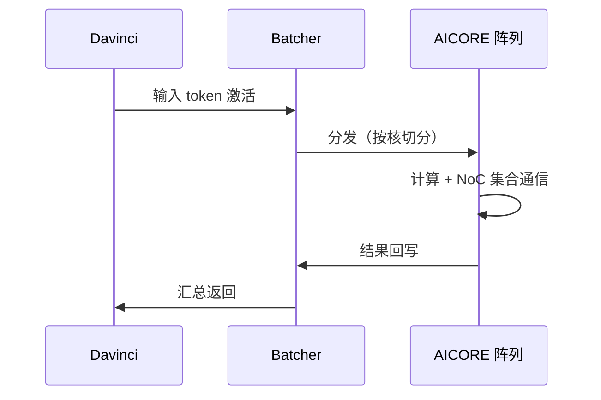

因此 WSE 适合的是**粒度足够大的整层算子**（整个 FFN、整组投影），而不是细粒度算子——后者的往返开销会吞掉全部收益。这也解释了三分离为什么按整层算子切分。

### 6.3 UB 总线

| lane 分配 | 速率 | 用途 |
|---|---|---|
| 8 lane | 8 × 224 Gbps = 224 GB/s | 组网互连（die 间 / 与 Davinci） |
| 1 lane | 1 × 112 Gbps = 14 GB/s | 机柜内 Host CPU |
| **合计** | **9 lane** | |

两条观察：

- **组网带宽（224 GB/s）远小于单核 local DRAM（1 TB/s）。** 器件间只能传激活，不能传权重——权重必须驻留。这是三分离部署可行的前提。
- **Host 通道（14 GB/s）是控制面尺度。** 它只能跑命令与小量元数据，不在推理关键路径上。

---

## 第三部分 · 软件架构

## 7. 软件栈总览

软件栈有**六层**，其中三层是开发者可见的，三层是工具链内部的。

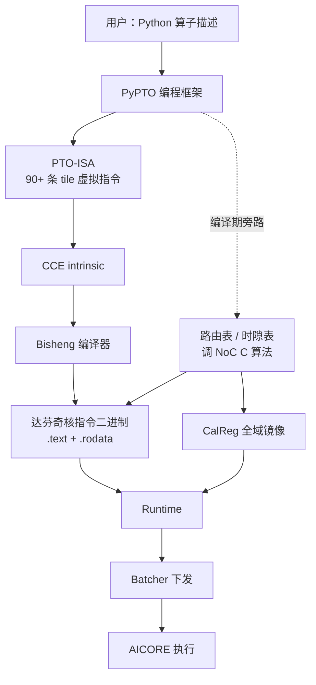

### 7.1 各层契约

| 层 | 输入 | 输出 | 对上层隐藏什么 |
|---|---|---|---|
| **PyPTO** | 用户算子 + 切分意图 | PTO 指令序列 + 通信表 | 拓扑、时隙、核间同步细节 |
| **PTO-ISA** | tile 级语义 | 跨代统一的虚拟指令 | 不同代 Ascend 的微架构差异 |
| **路由/时隙表** | IR 中的 GROUP 与集合语义 | `routeBits` 静态表 + `CalReg` | NoC 拥塞管理 |
| **CCE** | PTO 指令 | 近硬件 intrinsic | 寄存器分配、流水编号 |
| **Bisheng** | CCE | 达芬奇二进制 | 指令调度、寄存器分配 |
| **Runtime** | 二进制 + 权重 + 表 | 下发与调度动作 | Batcher 细节 |

### 7.2 一条不寻常的旁路

注意上图里那条虚线：**路由表与时隙表不走 PTO-ISA → CCE → Bisheng 这条主线**。它们在 PyPTO 编译期由 NoC 提供的 C 算法**一次性联合产出**，然后分两路落地：

- `routeBits` → 发射成 `.rodata` 静态表 → 与 `.text` 同批进二进制
- `CalReg` → 装载期写入 NoC 节点寄存器，**不进二进制**

这两条链物理分离，带来一个必须靠编译期兵兵担保的不变式（第 11.4 节的 O1）。

### 7.3 这个分层为什么必要

可以追问：为什么不让用户直接写 CCE？三个理由：

1. **跨代迁移。** PTO-ISA 把算子从具体微架构上解耦，同一份算子可跑 A2/A3/A5 与 WSE。
2. **通信与计算的联合优化需要全局视野。** 时隙表的生成需要知道**所有**集合通信的并发关系，这只能在框架层看到。
3. **正确性约束需要类型系统抽保。** 例如路由与时隙必须同源这类不变式，靠手写 CCE 无法保证。

## 8. PyPTO 编程框架

PyPTO 是用户写作算子的入口，也是整个软件栈里**唯一同时看到计算与通信全局视野**的一层。它在 WSE 上承担的职责比在传统 Ascend 上多一块：生成路由与时隙信息。

### 8.1 用户写什么

算子以 tile 为单位描述，而不是以标量循环描述：用 `TLOAD` / `TMATMUL` / `TADD` / `TSTORE` 这类指令拼出数据流，用 `TSYNC` 与 `Event` 表达流水依赖。核间通信同样是 tile 级的，与计算指令共享同一套 tile 类型与事件语义。

开发模式有两条：

| 模式 | 用户控制什么 | 适用 |
|---|---|---|
| **Auto** | 只写计算语义，tile 划分与同步交给框架 | 快速验证逻辑 |
| **Manual** | 显式 `TASSIGN` 绑定片上地址、自控事件 | 性能打磨 |

### 8.2 核间通信的两条路径

WSE 没有 GM，所以切分后的 tensor 必须靠显式通信拼回来。PyPTO 提供两套语义，按**拓扑是否可算**分流：

| | **GridPipe（非 Calendar）** | **TCalendar** |
|---|---|---|
| 适用拓扑 | 整行、整列、子矩形或显式 peer——软件能现场算出对端 | 任意、非均匀或时隙化拓扑 |
| PTO 接口 | `TPUSH` / `TPOP` / `TREDUCE` / `TBROADCAST` | `TCalendar<K>` |
| 控制面 | 显式 FIFO 门铃（READY / FREE / CLOSE） | 无硬件状态；路径与时隙随包走 |
| 完成语义 | READY/FREE 闭合跨核 FIFO | MTE4 按实收有效字节计量，达 `expVal` 即完成 |
| 信号量占用 | 占用 | **不占** |

集合通信语义覆盖 `AllGather` / `Reduce` / `AllReduce` / `ReduceScatter` / `Scatter` / `Gather`；首期实现 `AllGather` 与 `Reduce`，其余预留码位。

### 8.3 PyPTO 在编译期多做的七件事

这是 WSE 特有的。编译算子时，PyPTO 需额外完成：

1. 从 IR 识别 GROUP、集合通信语义与**集合间并发关系**
2. 读入目标芯片拓扑与 PG 信息（这两项**不属于 IR**）
3. 调用 NoC 提供的 C 算法，一次产出 `routeBits` 与 `CalReg`
4. 发射 `.rodata` 静态表，64 B 对齐，**不做 per-core 裁剪**
5. 为每个调用点固定立即数：`keyId` / `opcode` / `expVal` / `capacity` / `selfOff`
6. 校验十余条结构约束（位对合法、诱导子图为树、落核完备、收发守恒……）
7. 下沉指令序列：`LD → TSYNC → align → MTE4 感知 → MTE3 send → join`

**不需要做的三件事**同样关键：活跃区间分析、按容量装箱、与 GEMM 的 L1 分配器互斥——因为路由表不占 L1，只受 D-Cache 预算约束。

## 9. PTO-ISA

PTO（Parallel Tile Operation）是 Ascend CANN 定义的 **tile 级虚拟 ISA**，定义了 90+ 条标准 tile 指令。它不是硬件指令集，而是一层稳定的编程契约。

### 9.1 抽象机模型

PTO 的机器模型有四个要素：

| 要素 | 含义 |
|---|---|
| **Tile** | 带形状、数据类型与物理位置修饰的二维数据块 |
| **Buffer 层级** | `__gm__` / `__cbuf__`（L1）/ `__ubuf__`（UB）等地址空间限定词 |
| **Pipe** | `PIPE_M`（Cube）/ `PIPE_V`（Vector）/ `PIPE_MTE1..4` 等独立流水 |
| **Event** | 流水间依赖的显式表达（`TSYNC` 等待，`RecordEvent` 发布） |

### 9.2 指令分类

| 分类 | 代表指令 |
|---|---|
| 同步 | `TSYNC`、`SYNCALL` |
| 资源绑定 | `TASSIGN`、`SETFMATRIX` |
| 数据搬运 | `TLOAD`、`TSTORE` |
| 矩阵 | `TMATMUL` |
| 逐元素 | `TADD`、`TMUL`、`TEXP`、`TRELU`…… |
| 轴归约 | `TROWSUM`、`TCOLMAX`…… |
| **通信扩展** | `TPUSH`/`TPOP`、`TREDUCE`/`TBROADCAST`、**`TCalendar`** |

通信扩展集是本系统的重点：它们遵循与计算指令相同的 tile 抽象与事件语义，因此**通信可以与计算写在同一个融合 kernel 里**，而不是两个阶段。这对极低时延目标至关重要。

### 9.3 为什么需要这一层

PTO-ISA 与达芬奇核指令是 **多对多** 映射，不是改名：一条 `TMATMUL` 展开成一系列 `LOAD2D` / `MAD` / `FIXPIPE`，具体展开形态随代际变化。把这层差异固定在工具链里，算子源码才能从 A2/A3 直接移到 WSE。

对 WSE 而言还多一层价值：**取消 GM 是一个地址空间层面的改动**。原本写成 `__gm__` 的访存需要重新落到 local DRAM 或核间通信上，这类重写由 PTO backend 承担，用户算子逻辑不变。

## 10. 编译流程

从用户算子到可下发二进制，主线四跳，旁路一条。

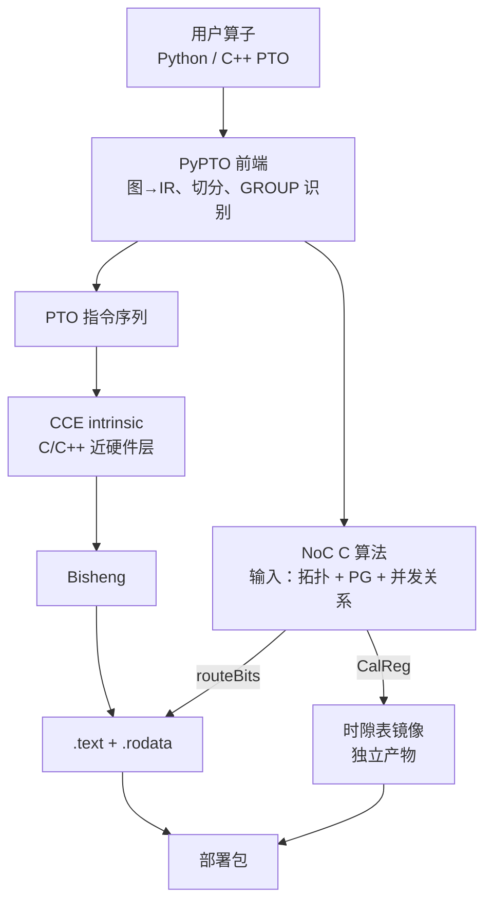

### 10.1 各阶段产物

| 阶段 | 输入 | 产物 |
|---|---|---|
| PyPTO 前端 | 算子描述 | IR；tile 几何；GROUP 与集合语义 |
| NoC C 算法 | 拓扑 + PG + 集合间并发关系 | 逐 source 的 `routeBits`；全域 `CalReg`；`conflictProof` |
| PTO 下沉 | IR | PTO 指令序列 + 立即数 |
| CCE 层 | PTO 指令 | intrinsic 调用，含 `__ubuf__` 等限定词 |
| Bisheng | CCE | 达芬奇机器码 |
| 链接 | 目标文件 | `.text` + `.rodata`（同一批） |

### 10.2 编译期必须跑过的自检

这套自检不是可选项。它们是"删掉原子选表指令"后唯一的一致性锚点：

| 编号 | 禁令 | 怎么查 |
|---|---|---|
| **F1** | `.data` / `.bss` 中不得出现 Calendar 自有符号 | `nm` 看符号类型，应接近 0 |
| **F2** | `CalendarKeyRef` 常量不得被物化（不得取地址） | 符号表中不应出现 `kRowAllGather` 等 |
| **F3** | `.rodata` 段 `AddrAlign ≥ 64` | `readelf -S` |
| — | `kCalendarRoute` 必在 `.rodata`，大小 == `keyCount×节点数×16` | `nm` 类型为 `R`/`r` |
| — | 反汇编中 `opcode` 确实是立即数 | 反汇编检查 |
| — | 反汇编中**没有**任何 Calendar 专用控制面指令 | 反汇编检查 |

### 10.3 三个版本号

编译产物携带三个版本号，装载期联合校验，任一不匹配必须 fault：

| 版本号 | 标识什么 |
|---|---|
| `topologyVersion` | 编译期假设的物理拓扑 |
| `calendarVersion` | 时隙表内容 |
| `routeVersion` | `routeBits` 静态表内容 |

它们是代替"一条指令原子选中路由/时隙"的系统级保险丝。

## 11. Calendar 通信编排

Calendar 是为 WSE NoC 设计的通信优化方案：**把"走哪里"和"何时发"两类信息都挪到编译期，运行期 NoC 只做被动执行。**

### 11.1 两类信息、两条载体

| | **路由信息** | **时隙信息** |
|---|---|---|
| 形式 | `routeBits`：每节点一个 `{P,L}` 位对 | `CalReg[opcode]`：NoC 节点常驻寄存器 |
| 大小 | 40 节点 → 80 bit | 内部格式由 NoC 定义 |
| 存哪里 | `.rodata` 静态表，D-Cache 取用 | NoC 节点寄存器 |
| 什么时候写 | 随二进制下发，模型加载一次 | 装载期原子写入，kernel 期只读 |
| 核内表现 | 两条普通标量 64 bit LD | **一个 3 bit 编译期立即数 `opcode`** |

从核的角度看，时隙信息就是**对 NoC 节点寄存器的一次索引** `CalReg[opcode]`——程序不感知寄存器内部格式，也不感知 cycle。

### 11.2 `routeBits` 的语义

每个节点一个位对，四种取值：

| 位对 | 含义 |
|---|---|
| `00` | 无关 |
| `10` | 经过不落核 |
| `11` | 经过且落核（可续转） |
| `01` | **非法** |

NoC 节点只看自己的位对：`L=1` 落核提交；转发集 = 【`P=1` 的邻居】减【入口】。因此**每跳无表、无查表通路、无状态**。

编译期必须校验：`{P=1}` 的诱导子图连通、含 source、**无环（是树）**。否则包会在 mesh 上无限繁殖。

### 11.3 一轮集合的七个步骤

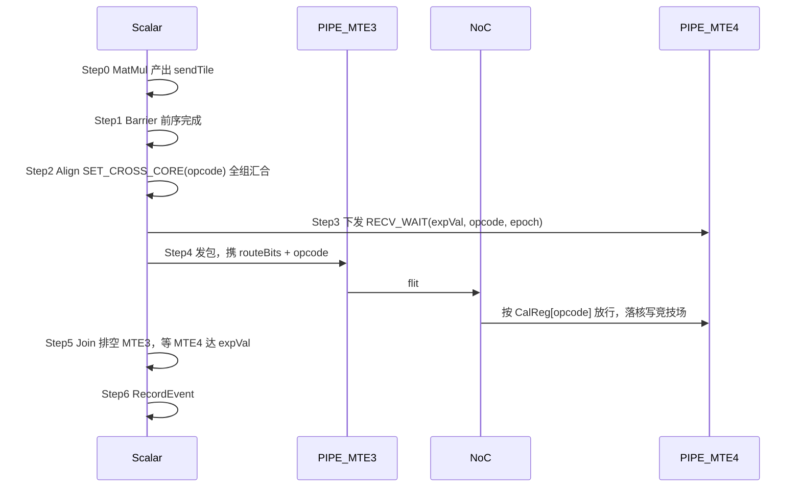

两个容易误解的点：

- **MTE4 不搬运数据。** 载荷由 NoC 直接写进本核竞技场，MTE4 只对匹配 `{opcode, epoch, dstRange}` 的有效载荷**计量**，累计达 `expVal` 才退休。
- **发包走 MTE3，不是新流水。** MTE3 就是既有的核间写通路，本方案只给它加操作数。

完成条件是**字节计量**，不是通知：不设 `Notify`，不分配信号量，不建 `collectionEpoch`。

### 11.4 四条排序不变式

| # | 不变式 | 破坏后果 |
|---|---|---|
| **O1** | **路由与时隙同源**：同一次发包的 `routeBits` 与 `opcode` 必须来自同一逻辑身份 | 包沿正确路径走、按错误时隙放行 ⇒ 计划外冲突，**编译期查不出来** |
| **O2** | **对齐先于发送**：Step2 返回后才入队 MTE3 | 错峰失效 ⇒ 链路冲突（**不是**静默错转发） |
| **O3** | **感知先于发送，排空先于等待** | 丢失早到数据的计量，或全组死锁 |
| **O4** | **`routeBits` 就绪先于首包** | 用到未定义路由位图 |
| **E1** | **分支参与一致**：同 `opcode` 域内成员核调用次数与顺序逐次一致 | `epochCtr` 错位 ⇒ 按错 epoch 丢包 |

**O1 是本方案的主要新增风险。** 缓解手段是把一致性上移到类型系统：`keyId` 与 `opcode` 由同一逻辑身份一次解析出来，封装成不可拆分的编译期常量对 `CalendarKeyRef`，调用点不得分别传入。

### 11.5 代价模型：die 级一份拷贝

静态表按**全部节点**发射，不做 per-core 裁剪，全片镜像逐字节相同。代价分两块，量级完全不同：

| | 占用 | 量级（`keyCount`=2、40 节点） |
|---|---|---|
| DDR | `keyCount × 节点数 × 16 B` | 1 280 B，**die 级一份** |
| 每核 D-Cache | `keyCount` 条 64 B 行 | **128 B** |

并且 D-Cache 占用可以再降四倍：把表转置成 node-major 后，本核的 `keyCount` 个表项连续，占 `⌈keyCount/4⌉` 条行。指令数、寻址形态、表总字节数全不变（待决项 C-9）。

## 12. Runtime 与调度

Runtime 负责把编译产物变成芯片上的状态，并在每次推理时驱动 Batcher。它的工作分**三个频度档位**，混淆这三档是性能问题的常见根源。

| 档位 | 做什么 | 频度 |
|---|---|---|
| **装载期** | kernel 二进制下发；权重写入各核 local DRAM；`CalReg` 全域镜像原子写入；三版本号校验 | 模型加载一次 |
| **每次 launch** | task descriptor；args buffer（含 `blockId`）；输入张量；相边界 barrier | 每算子一次 |
| **运行期** | 不插手 | — |

### 12.1 三类下发物的去向

| 下发物 | 经过 | 落到哪一级 | 频度 |
|---|---|---|---|
| kernel 二进制（`.text`+`.rodata`） | Batcher | DDR 代码段/数据段，**miss 时经 Batcher.mem 到 I$/D$** | 每 kernel 一次 |
| 模型权重 | Batcher | **各核 local DRAM** | 模型加载一次 |
| `CalReg` 时隙表 | 不经 Batcher.mem | **NoC 节点寄存器** | 一次性 |
| 输入激活 | Batcher | 各核 UB / L1 | 每次推理 |

这张表是本系统最容易记错的一张。三个常见误解："路由表会进 L1"（不会，进 D-Cache）、"指令要过 local DRAM"（不过）、"时隙表每轮下发"（不是，一次性）。

### 12.2 冷启动与稳态

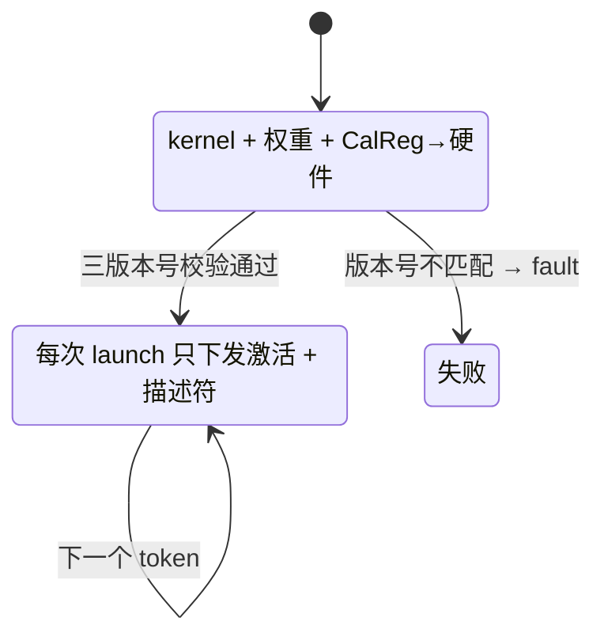

稳态下每次 launch 的下发量极小——**不下发任何 Calendar 数据**，不做 per-core 展开，不下发运行期描述符。这正是把路由信息从 B 类推到 A 类的收益（第 4.2 节）。

### 12.3 调度约束

Runtime 必须兑现四条约束，否则集合通信会错：

1. **按完整 group 调度。** 分 wave 时不得拆开正在同步的组。
2. **相边界插 barrier。** 保证 launch 之间全片 Calendar 流量排空——跨 launch 的 epoch 隔离完全依赖这一条。
3. **`CalReg` 写入必须在停机窗口内。** 写入期间不得有 Calendar 流量在飞。
4. **提供 `blockId`。** 优先用 `block_idx` SPR（0 次访存）；否则随 args 下发，变成 B 类值，多一次 LD。

同时 Runtime **不做**两件事：不预建 `collectionEpoch`，不分配 notify counter。每轮 epoch 由核内计数器给出，Host 看不到 kernel 内的轮次。

---

## 第四部分 · 端到端执行流程

## 13. 编译期：从 Python 到二进制包

本部分把前面的静态架构串成一条时间线。三个阶段的分界标志很清楚：**编译期**结束于二进制包生成，**加载期**结束于三版本号校验通过，**运行期**从 kickstart 开始——过了 kickstart，Host 就再也插不上手。

### 13.1 时间线

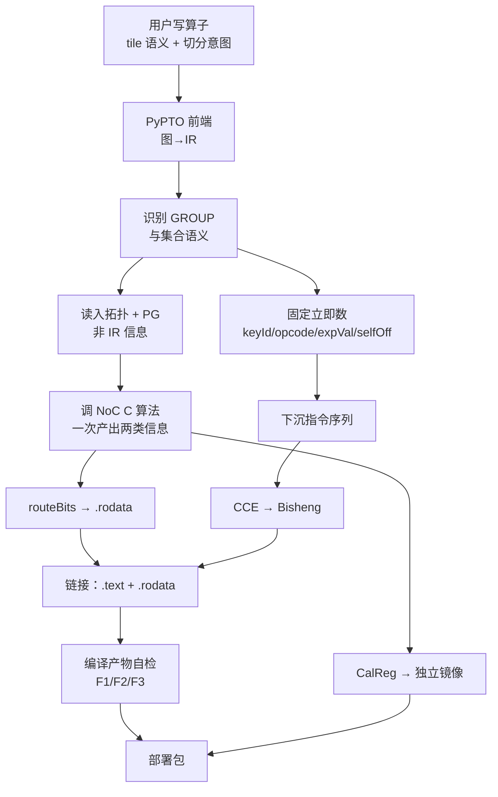

### 13.2 关键一步：一次算法调用产出两类信息

路径与时隙必须在**同一次** NoC 算法调用中生成，不能分两次。原因：共用同一 `opcode` 的全部逻辑身份必须相互无冲突，而"无冲突"只有在算法同时看到它们时才能保证。算法返回 `conflictProof` 作为凭据。

算法的输入里有一项容易被漏掉：**集合间并发关系**。它不在 IR 里，需要 PyPTO 从调度计划推出并传给算法；算法据此保证同 `opcode` 的两个集合不会同时在飞、也不会同时汇合。不满足则重新分相。

### 13.3 产物清单

| 产物 | 形式 | 去向 |
|---|---|---|
| kernel 机器码 | `.text` | DDR 代码段 |
| `routeBits` 静态表 | `.rodata`，64 B 对齐 | DDR 数据段 |
| `CalReg` 全域镜像 | 独立二进制段 | NoC 节点寄存器 |
| 三个版本号 | 元数据 | 装载期校验 |
| 模型权重 | 按核切好的分片 | 各核 local DRAM |

## 14. 加载期：三条下发链路

加载期把三类东西放到位。它们走**三条不同的路**，落在**三个不同的存储层级**：

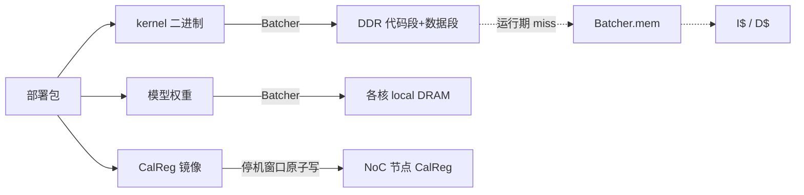

### 14.1 三条链路对照

| | kernel 二进制 | 模型权重 | `CalReg` |
|---|---|---|---|
| 经 Batcher | 是 | 是 | **否**（直达 NoC 节点） |
| 终点 | DDR，运行期回填 I$/D$ | 各核 local DRAM | NoC 节点寄存器 |
| 经 local DRAM | **否** | — | 否 |
| 经 L1 | **否** | 否 | 否 |
| 写入要求 | 无特殊要求 | 按 2 KB page 对齐 | **停机窗口内原子写，不得有流量在飞** |

第三列的特殊性值得强调：`CalReg` 是唯一**不经 Batcher** 的下发物，因为它的目的地是 NoC 而不是 AICORE。

### 14.2 装载期校验

校验通过才能进稳态。失败必须 fault，不得降级运行：

- `topologyVersion` / `calendarVersion` / `routeVersion` 三方匹配
- 目标芯片物理拓扑与编译期假设一致（无坏核/坏链重映射）
- `selfOff` 铺满性；各核行覆盖完整；`expectedRxBytes == expVal`
- 对称地址、容量、`opcode` 合法；`blockId` 在范围内

### 14.3 kickstart

kickstart 是分界线：置 PC = 入口，置栈指针，I$ 与 D$ invalidate。**它不搬任何数据**，只动控制状态。过了这一点，剩下的全是片上自治。

## 15. 运行期：一次 decode step

这是全文的汇合点。以 WSE-Lite #1（MoE FFN）为例，一个 token 经过的完整路径：

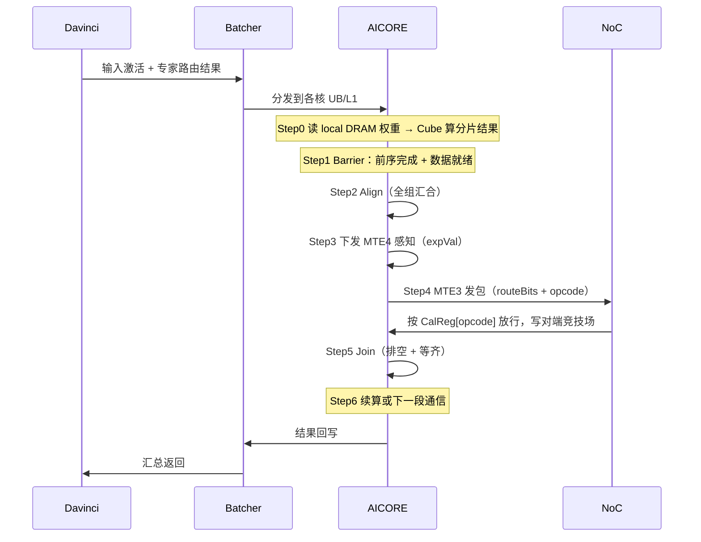

### 15.1 时间花在哪里

把一次调用拆成四段，四段的优化手段完全不同：

| 段 | 主导因素 | 怎么压 |
|---|---|---|
| 器件间往返 | UB 总线 + Batcher 分发 | 加大算子粒度，减少往返次数 |
| 核内计算 | local DRAM 带宽 | 降精度（FP8/FP4），2 KB 对齐 |
| 核间通信 | NoC 链路 + 对齐开销 | Calendar 错峰；切分选通信量小的轴 |
| 尾部同步 | 最慢核 | 负载均衡；避免专家倾斜 |

### 15.2 两个异步边界怎么跨

第 2.2 节的两道异步边界在运行期具体化为：

- **Batcher ↔ AICORE。** 分发与核执行不共享时间基准，核靠数据就绪信号开工，而不是靠约定时刻。
- **AICORE ↔ NoC。** 核只能表达"我到了"（Step2 报到），无法表达"第几拍发"。发包时机由 NoC 侧 `CalReg` 决定，BSP 在硬件内部对齐全组时间原点，**不返回给程序**。

对齐后硬件预留一段 **arm lead time**，用于让核把 Step3 的感知命令和 Step4 的全部发包描述符入队。编译期必须校验这段时间足够覆盖最坡情况。

### 15.3 完成判定

收侧不用等通知，而是**数字节**：

```text
expVal（AllGather，不含本地自拷贝）
  = rowCount × rowBytes × (memberCount − 1)
```

只有**已提交到目标接收范围的有效 payload** 才计数；包头、填充、重传、本地自拷贝都不计。这把"集合完成"从一个分布式协议问题降成了一个本地计数器问题。

代价是硬件必须有**去重机制**：多播分叉的副本要按落核点去重，否则 `expVal` 会被重复计数提前满足，集合提前返回。这是待决项 S-6。

## 16. 核间集合通信

没有 GM，"把切分的 tensor 拼回来"就不再是一次内存读写，而是一次显式集合通信。这是 WSE 编程模型与传统 NPU 最大的差别。

### 16.1 对称地址模型

发包指令的目的操作数不是"对端的物理地址"，而是**全组一致的对称地址 + 本核段偏移**：

```text
dstSymOff = recvSymBase + selfOff + r × recvRowStride
```

三条性质：

- 每个成员核的接收竞技场布局相同，`recvSymBase` 全组一致
- `selfOff` 区分"谁写哪一段"，编译期确定，必须不重叠地铺满每一行
- **转发不改变落点**：包沿路经过多少节点，写到哪里都由这个公式决定

### 16.2 AllGather 的执行形态

以行组 8 路 AllGather 为例：

1. 每个成员持有自己那一段 `sendTile`
2. 全组在 Step2 对齐
3. 每个成员向组内其他成员广播自己那一段，路径由自己那行 `routeBits` 决定（一棵以自己为根的树）
4. 每个成员的竞技场被 `memberCount` 段铺满
5. MTE4 计数达 `expVal` 即完成

fabric 若不支持 self-delivery，本核那一段由 Step4s 用普通 `copy_ubuf_to_ubuf` 补写，**不计入 `expVal`**。

### 16.3 归约类语义

归约在中间节点完成：位对为 `11` 且存在下游 `P` 邻居的节点是**归约点**，在此 merge 后续转。flit 头的 `redOp` 字段（3 bit）给出算子（`None/Sum/Max/Min/Prod`）。

这里有一个**必须在 flit 头格式冻结前解决**的缺口：`redOp` 单独不足以确定机器运算，还需要元素类型（建议 3 bit，取 `vtype_t` 子集）。首期只上 `AllGather` 时不阻塞，但不能忽略（待决项 C-3）。

### 16.4 与计算的流水重叠

MTE3、MTE4 与 Cube/Vector 是独立流水，因此通信可以与计算重叠。两条关键约束：

- **MTE4 的阻塞不得阻止 AICORE 继续向 MTE3 发指令。** 否则 Step3 会把 Step4 堵死，全组死锁。
- **`pipe_barrier(PIPE_MTE3)` 必须等实际发出**，不得因为"尚未被 `CalReg` 放行"提前返回。

满足这两条后，一个典型的优化形态是：第 `i` 分片的 AllGather 在飞时，Cube 已在算第 `i+1` 分片。这要求竞技场双 buffer，占 UB 或 L1 容量（竞技场到底落 UB 还是 L1 是待决项 S-2）。

---

## 第五部分 · 业务映射与性能

## 17. 业务映射：MoE FFN

以 DeepSeek-V4 Pro 的 MoE FFN 为例。一个专家的 FFN 是三个矩阵：`W_gate`、`W_up`（都是 `[H, I]`）与 `W_down`（`[I, H]`）。

### 17.1 为什么切 N 轴

切分轴的选择直接决定通信量，而第 4.4 节已经说明 NoC 单链路（128 GB/s）比 local DRAM（1 TB/s）窄一个量级：

| 切法 | 每核持有 | 需要的通信 | 通信量 |
|---|---|---|---|
| **切 N（输出轴）** | `W[:, n_i]` 全列 | 算完拼接 → **AllGather** | 激活级，小 |
| 切 K（归约轴） | `W[k_i, :]` 全行 | 算完求和 → AllReduce | 激活级，但多一轮归约 |
| 不切，按专家分核 | 整个专家 | 无 | 0，但负载随路由倾斜 |

切 N 轴的代价是一次 AllGather，量级是**激活**而不是权重——这正是 NoC 能承受的。切 K 轴通信量相近但多一道归约，且归约语义首期未完全定义（待决项 C-10）。

### 17.2 两段式 AllGather

若参与核排成二维 mesh，直接做全连接 AllGather 会把中心链路撞满。分两相可以把流量限制在行列内：


两相各用一个独立的逻辑身份（`keyId`）与一个 `opcode`，因此 `keyCount = 2`，每核 D-Cache 占用 2 条 64 B 行（node-major 布局下 1 条）。

### 17.3 容量约束

单核 local DRAM 384 MB 是硬上限。以 FP8 权重估算，单个专家的三个矩阵共 `3 × H × I` 字节；根据 `H`、`I` 与专家数，可以直接算出一个核能驻留几个专家、需要几个核才能装下整层。具体模型尺寸尚未提供（附录 Q5），因此本节不给具体数字。

### 17.4 一个真正的难点：负载倾斜

MoE 的路由是数据相关的，每个 token 激活哪几个专家运行期才知道。这与 Calendar 的前提存在张力：

| | Calendar 需要 | MoE 路由的现实 |
|---|---|---|
| 通信形状 | 编译期确定 | 专家选择运行期确定 |
| 参与成员 | 固定 group | 每轮可能不同 |
| 调用次数 | 同 `opcode` 域内逐次一致（不变式 **E1**） | 核可能本轮无活可干 |

不变式 E1 要求成员核**不得有条件地跳过某一轮**。因此切分必须让所有参与核无条件参与每一轮集合（即使本轮发零），而不能按"本核本轮有没有专家被激活"决定是否调用。**这是 FFN 映射方案里最容易出错的一点**，具体策略需要确认（附录 Q6）。

## 18. 业务映射：Attention 权重投影

WSE-Lite #2 只承担 Attention 的**前后投影**，不碰主体计算。这条分界看上去奇怪，实际上它把一个算子沿着 roofline 性质切开了。

### 18.1 为什么只拿投影

| | 前/后投影（Q/K/V/O） | Attention 主体（QKᵀ/Softmax/AV） |
|---|---|---|
| 读什么 | **权重矩阵**，尺寸固定 | **KV Cache**，尺寸随序列长度增长 |
| 计算强度 | ≈ 2×batch，极低 | 取决于 KV 长度与 batch |
| 驻留可行性 | **可以**，权重不变 | 不行，KV 每步追写 |
| 适合 WSE | 是 | 否 |

关键在第三行：WSE 的模型是"权重驻留、激活流动"。KV Cache 每步都在长，不符合驻留模型，放在 Davinci 侧才合理。

### 18.2 一层的协同时序

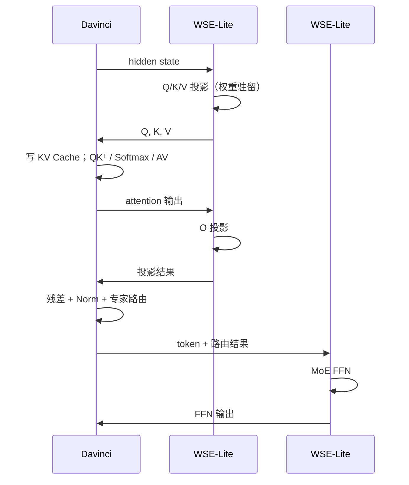

每层共 **3 次器件间往返**（2 次到 #2，1 次到 #1）。这是三分离的固定成本，不可消除，只能靠两个手段摊薄：

1. **流水化。** 层 `i` 的 FFN 与层 `i+1` 的 Q/K/V 投影分属不同器件，可以重叠。
2. **批量合并。** 多个请求的同一层投影合成一次调用，把往返开销分摊到更大 batch 上——这也是 Batcher 名字的含义。

### 18.3 切分与通信

Q/K/V 投影天然按 head 切分，head 之间无依赖，因此：

- 按 head 分核 ⇒ 每核算出完整的若干个 head，**无需核间通信**
- 单个 head 太大装不下时才切 N 轴，退回与 FFN 相同的 AllGather 形态

O 投影则相反：它的输入是所有 head 拼接后的结果，天然是沿 `K` 轴分布的，因此需要一次 **AllReduce** 或先 AllGather 再算。具体选哪种取决于归约语义的可用性（待决项 C-10）。

## 19. 关键设计权衡与性能分析

### 19.1 时延预算拆解

一次 WSE 协处理调用的时延分五块。每块的负责人不同：

| 块 | 受什么限制 | 弹性 |
|---|---|---|
| 器件间传输 | UB 总线 224 GB/s | 只能靠增大粒度摊薄 |
| Batcher 分发/汇收 | Batcher.mem + 异步边界 | 流水化可部分隐藏 |
| 核内计算 | local DRAM 1 TB/s | 降精度直接减半/减四分之三 |
| 核间通信 | NoC 128 GB/s/链路 + 对齐 | 切分选择；Calendar 错峰 |
| 尾部同步 | 最慢核 | 负载均衡 |

### 19.2 带宽与算力配比

前面算过：单核 FP16 平衡点 11.5 FLOP/Byte，FP8 为 45.9。这给出一个直接的工程结论：

| 精度 | 不再搬运-bound 所需 batch | 含义 |
|---|---|---|
| FP16 | ≈ 6 | 小 batch 解码仍搬运-bound |
| FP8 | ≈ 23 | 算力提升超前于字节数下降 |
| FP4 | ≈ 46 | 同上，更极端 |

值得注意的是：**降精度对搬运-bound 算子的收益来自字节数，不来自算力。** FP16→FP8 把权重字节减半，搬运时间减半；算力的 4× 提升在这类算子上基本用不上。这意味着 FP8/FP4 的**精度可接受性**比峰值算力更重要。

### 19.3 Calendar 的收益与成本

| 项 | 收益 | 成本 |
|---|---|---|
| 每跳无表无状态 | NoC 节点简化，无查表延迟 | flit 头 ≈ 12 B，占链路 **19%** |
| 时隙错峰 | 尾时延可预测，无拥塞 | 要求流量模式编译期可知 |
| 路由表进 `.rodata` | 每核 D-Cache 仅 `keyCount` 行；**每次 launch 零下发** | 依赖拓扑同构；坏核需降级路径 |
| 完成靠字节计量 | 不占信号量，无 notify | 需硬件去重；需跨 launch 排空 |
| 控制面新增指令 0 条 | 复用既有跨核报到 ISA | 信号量位宽需 ≥ 6 bit |

### 19.4 三个软件侧无法检测的死角

这三项如果硬件不兑现，软件**无法发现**，也无法兼容：

| 编号 | 依赖 | 不满足时 |
|---|---|---|
| **HW-5** | 接收指令能按 `{opcode, epoch, dstRange}` 累计有效 payload 字节并据此退休 | 本方案最主要的正确性风险 |
| **HW-7** | 跨核同步信号量位宽 ≥ 6 bit（现为 4 bit，最多 15） | 计数器回绕 ⇒ 未到齐就放行 |
| **SW-1** | launch 边界前全片 Calendar 流量已排空 | 上一 launch 的滞留副本被误计入 |

HW-7 特别值得注意：现有 4 bit 位宽最多支持 15 核报到，而 FFN phase B 需 32 核、全片集合需 40（若按 48 节点则更多）。这是一个**确定的、已知的硬件修改点**，不是优化项。

---

## 附录

## 附录 A：待确认信息清单

以下均为 **WSE 系统专有**、且无法从现有资料推出的信息。本文在相应位置标了假设或留白，**没有构造数字**。按阻塞程度排序。

### A.1 阻塞级（不确认则相关章节无法定稿）

| # | 问题 | 影响章节 |
|---|---|---|
| **Q1** | **NoC 节点数到底是 40 还是 48？** 需求给的是 6×8 mesh，现有 Calendar 设计文档按 40 节点（5×8）写就，`routeBits` 的 80 bit 宽度直接来自这个数。是 48 个节点中 40 个挂 AICORE（其余 8 个是 I/O / Batcher 节点），还是文档需更新为 96 bit？ | 5、11、17 |
| **Q2** | **一个 WSE-Lite 到底有几个 Reticle / 几个 die？** 全文按单 Reticle 写；若多 Reticle，需要知道：跨 Reticle 是否仍是 mesh、带宽多少、是否同步（现有表述只说"Reticle 内同步"） | 2、5、17 |
| **Q3** | **Batcher 的具体规格**：Batcher.mem 容量与带宽；对 AICORE 侧的聚合带宽；一个 Batcher 服务多少核；是否支持多个并行分发通道 | 6、14、19 |
| **Q4** | **DDR 在架构中的位置**。文档反复出现 "DDR → Batcher.mem → I$/D$"，但需求侧只描述了 local DRAM。这个 DDR 是独立于 local DRAM 的片外存储，还是就是 local DRAM 的另一种叫法？容量与带宽？ | 4、14 |
| **Q5** | **目标模型尺寸**：DeepSeek-V4 Pro 的 `H` / `I` / 专家数 / top-k / head 数 / 权重精度。没有这些就无法给出具体切分方案与时延数字 | 17、18、19 |
| **Q6** | **MoE 负载倾斜的处理策略**。不变式 E1 要求成员核不得条件跳过集合，但 MoE 路由是运行期决定的。是采用固定容量（capacity factor）+ 发零，还是其他机制？ | 17 |

### A.2 设计定稿级（不确认不阻塞白皮书，但阻塞落地）

| # | 问题 | 影响章节 |
|---|---|---|
| **Q7** | **竞技场落 UB 还是 L1？**（待决项 S-2）决定 tile 类型的地址空间限定词与双 buffer 的容量预算 | 16、3 |
| **Q8** | **权重在 local DRAM 中的存储布局与预取机制**。是由 MTE 从 local DRAM 直接搬到 L0B，还是必经 L1 中转？2 KB page 与 L0B 512 KB 怎么配合？ | 3、4、15 |
| **Q9** | **Davinci ↔ WSE-Lite 的接口形态**：是内存语义（写对端窗口）还是消息语义？同步还是异步？一次往返的基础时延量级？ | 1、6、18 |
| **Q10** | **两台 WSE-Lite 的硬件是否完全相同？** 还是按算子特点做了差异化配置（如不同核数 / 容量）？ | 1 |
| **Q11** | **权重精度的实际选型**。FP8 与 FP4 在目标模型上的精度可接受性已验证吗？是否需要混合精度（如激活 FP16 + 权重 FP8）？ | 19、3 |
| **Q12** | **单核或单链路故障时的降级路径**（待决项 C-11）。是允许编译期假设拓扑同构，还是从一开始就按可重映射设计？ | 11、14 |

### A.3 已在现有文档中立档的待决项

以下不重复列举，详见《WSE Calendar 方案》第 6.3 节：S-1〜S-7（接口与编码）、C-1〜C-12（方案专有）。其中对本白皮书结构有影响的是 **C-2**（flit 头承载形态）、**C-3**（归约元素类型）、**C-9**（表布局 key-major vs node-major）。

### A.4 本文明确采用的假设

以下假设已写进正文，若不成立需回改：

1. 单 Reticle，6×8 mesh，48 个节点位置（待 Q1/Q2 修正）
2. 权重在模型加载时一次性驻留 local DRAM，稳态不重新下发
3. 每层 3 次器件间往返（Q/K/V 投影、1 次；O 投影、1 次；FFN、1 次）
4. Cube 算力按 M×K×N per cycle 解读，每 MAC 计 2 FLOP

## 附录 B：术语表

| 术语 | 含义 |
|---|---|
| **AICORE** | WSE 的计算核，1 Cube + 1 Vector，1.4 GHz |
| **Batcher** | Host/Davinci 与 AICORE 阵列之间的唯一桥梁；内含 Batcher.mem |
| **UB（Unified Buffer）** | 核内 384 KB 片上缓冲 |
| **UB 总线** | 对外组网互连，9 lane（与上行同名不同物） |
| **local DRAM** | 每 AICORE 独享，384 MB @ 1 TB/s，2 KB page |
| **Calendar** | NoC 通信编排方案；路径与时隙均编译期确定 |
| **`routeBits`** | 每节点一个 `{P,L}` 位对的路径位图；随每个 flit 走 |
| **`{P, L}` 位对** | `00` 无关 / `10` 经过不落核 / `11` 经过且落核 / `01` 非法 |
| **`opcode`** | 时隙寄存器索引；兼作对齐信号量 id；编译期立即数 |
| **`CalReg`** | NoC 节点常驻的 Calendar 时隙寄存器；装载期写入，kernel 期只读 |
| **`expVal`** | 本轮期望接收的有效 payload 字节数；集合完成的判据 |
| **`blockId`** | 本核的 NoC 节点号；本方案唯一的运行期变量下标 |
| **对称地址** | 全组一致的接收区基址 + 本核段偏移 `selfOff` |
| **竞技场** | 每核的集合通信接收区（arena） |
| **A / B / C 类值** | 按下发时机分：随二进制 / 每次 launch / 核自产 |
| **PTO** | Parallel Tile Operation，CANN 定义的 tile 级虚拟 ISA |
| **Bisheng** | 毕昇编译器，将 CCE 转为达芬奇二进制 |
